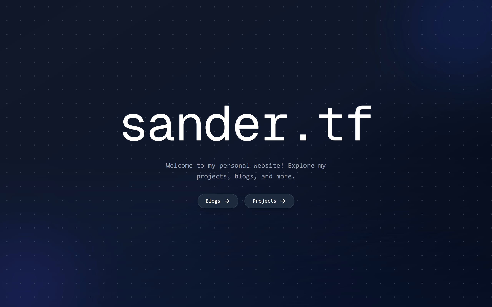

# sander.tf

sander.tf is my portfolio written in Next.js with Supabase as database backend.

### Tech Stack:
- Next.JS
- TailwindCSS
- Supabase

## Local Setup Guide

### Prerequisites
- Node.js (v16 or higher)
- Git
- A Supabase project

### Installation Steps

1. **Clone the repository**
    ```bash
    git clone https://github.com/sanderhd/sander-tf.git
    cd sander-tf
    ```

2. **Install dependencies**
    ```bash
    npm install
    ```

3. **Configure environment variables**
    ```bash
    cp .env.local.example .env.local
    ```
    Update `.env.local` with your Supabase credentials:
    ```
    SUPABASE_URL="https://your-project-ref.supabase.co"
    SUPABASE_SERVICE_ROLE_KEY="your-service-role-key"
    ```

4. **Start the development server**
    ```bash
    npm run dev
    ```

5. **Open in browser**
    Navigate to `http://localhost:3000`

### Troubleshooting
- Ensure your Supabase URL and service role key are set correctly
- Clear `.next` folder if you encounter build issues: `rm -rf .next`